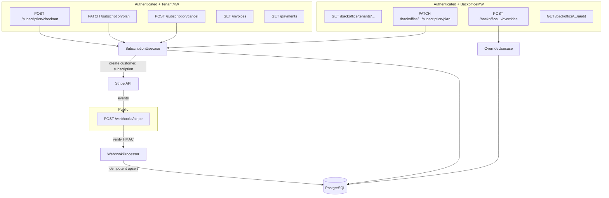

# Fase 4 — Operação SaaS: Plano de Implementação

## Context

Phases 1–3 are complete and merged to `main`. The platform has tenants, RBAC, billing domain (plans, subscriptions, entitlements, feature overrides), audit, and identity — but no payment provider integration, no webhook processing, no self-service subscription management, and no backoffice module. Phase 4 makes it a revenue-generating SaaS: connect Stripe, process billing webhooks, enable self-service plan changes, and build the backoffice administrative module.

Reference: `CLAUDE.md` — billing, backoffice, and webhooks are core MVP modules, not optional.

---

## Architecture Overview

---

## Key Architectural Decisions

### D1. BillingProvider interface with Stripe implementation
Interface `BillingProvider` in `internal/billing/provider/provider.go`. Single implementation: Stripe. Enables future provider swaps. Dependency: `github.com/stripe/stripe-go/v82`.

### D2. Webhook as public route
`POST /webhooks/stripe` — no auth middleware. Validated via Stripe HMAC signature (`webhook.ConstructEvent()`). Returns 200 quickly; processing is synchronous but idempotent.

### D3. Backoffice as separate module with its own middleware
New `internal/backoffice/` module. `BackofficeMiddleware` replaces `TenantMiddleware` for backoffice routes — no `X-Tenant-ID` required. Uses `backoffice_users` + `backoffice_user_roles` for authorization (separate path from tenant RBAC since `RequirePermission` at `internal/rbac/middleware.go:21` is tenant-scoped via `TenantIDFromContext`).

### D4. Webhook idempotency via dedicated table
`billing_webhook_events` with `provider_event_id UNIQUE`. `INSERT ... ON CONFLICT DO NOTHING` + check rows affected. Zero rows = already processed → skip.

### D5. No worker for now
For this phase, webhook retry is deferred — failed events are marked in the DB and can be reprocessed manually or via a future worker. This keeps scope tight.

---

## Existing Infrastructure Reused

| Pattern | Location |
|---------|----------|
| `db.RunInTx(ctx, pool, fn)` | `internal/platform/db/db.go:32` |
| `audit.NewEntry(opts...)` + `auditSvc.Write()` | `internal/platform/audit/audit.go:49,124` |
| `server.RenderJSON()` / `server.RenderError()` | `internal/platform/server/server.go:98,87` |
| `identitydomain.TenantIDFromContext()` / `UserIDFromContext()` | `internal/identity/domain/user.go:65,48` |
| `rbac.RequirePermission(code, enforcer)` | `internal/rbac/middleware.go:21` — **tenant-scoped only** |
| Config via env + `envStr`/`envInt` | `internal/platform/config/config.go:99,106` |

---

## Migrations (000038–000042)

### 000038 — `create_billing_webhook_events`
Table for idempotent webhook event tracking with status lifecycle (pending → processed/failed/skipped).

### 000039 — `create_backoffice_users`
Tables `backoffice_users` and `backoffice_user_roles` for backoffice authorization path.

### 000040 — `seed_backoffice_roles_permissions`
Roles: `backoffice_support`, `backoffice_finance`, `backoffice_sales`. Permission: `overrides:manage`.

### 000041 — `add_subscription_plan_change_fields`
Adds `previous_plan_id` and `plan_changed_at` to `tenant_subscriptions`.

### 000042 — `add_plans_provider_fields`
Adds `provider_price_id` and `provider_product_id` to `subscription_plans`.

---

## Implementation Steps (Completed)

### Step 1 — Migrations
10 files (5 up + 5 down) in `services/api/migrations/`.

### Step 2 — Config + BillingProvider interface
- Added `StripeConfig` to `Config` struct
- Created `BillingProvider` interface and `StripeProvider` implementation using `stripe-go/v82`

### Step 3 — Domain extensions
- Extended `Plan`, `Subscription`, `FeatureOverride` structs with provider and tracking fields
- Created `Invoice`, `Payment`, `WebhookEvent` domain types

### Step 4 — Repository extensions
- Created `InvoiceRepository`, `PaymentRepository`, `WebhookRepository`, `SubscriptionRepository`, `OverrideRepository`
- Updated `postgres.go` queries to include new fields
- Added `Executor` interface for transaction participation

### Step 5 — Webhook processing
- `WebhookProcessor` usecase with idempotent event handling
- `WebhookHandler` HTTP handler with HMAC signature validation
- Handlers for: `invoice.paid`, `invoice.payment_failed`, `customer.subscription.updated`, `customer.subscription.deleted`

### Step 6 — Subscription management (self-service)
- `SubscriptionUsecase`: Checkout, ChangePlan, Cancel, Reactivate
- `SubscriptionHandler`: HTTP endpoints with error mapping

### Step 7 — Override management
- `OverrideUsecase`: CRUD with mandatory reason and audit trail

### Step 8 — Backoffice module
- `BackofficeMiddleware` + `RequireBackofficePermission` (separate from tenant RBAC)
- `Repository` with tenant listing, detail, audit log queries
- `Handler` with 15 endpoints for tenant/subscription/override/audit management

### Step 9 — Wiring in main.go
- Conditional Stripe provider initialization
- All repos, usecases, handlers wired
- Public webhook route, tenant-scoped self-service routes, backoffice route group

---

## Endpoints Summary

### Public (no auth)
| Method | Path | Description |
|--------|------|-------------|
| POST | `/webhooks/stripe` | Stripe webhook receiver with HMAC validation |

### Self-Service (tenant-scoped, `subscription:manage`)
| Method | Path | Description |
|--------|------|-------------|
| POST | `/subscription/checkout` | Create Stripe customer + subscription |
| PATCH | `/subscription/plan` | Upgrade/downgrade plan |
| POST | `/subscription/cancel` | Cancel subscription |
| GET | `/invoices` | List tenant invoices |
| GET | `/invoices/{id}` | Invoice detail |
| GET | `/payments` | List tenant payments |

### Backoffice (BackofficeMW + permission-gated)
| Method | Path | Permission | Description |
|--------|------|------------|-------------|
| GET | `/backoffice/tenants` | `tenants:manage` | List tenants |
| GET | `/backoffice/tenants/{id}` | `tenants:manage` | Tenant detail |
| GET | `/backoffice/tenants/{id}/subscription` | `billing:manage` | Subscription detail |
| PATCH | `/backoffice/tenants/{id}/subscription/plan` | `billing:manage` | Force plan change |
| POST | `/backoffice/tenants/{id}/subscription/cancel` | `billing:manage` | Force cancel |
| POST | `/backoffice/tenants/{id}/subscription/reactivate` | `billing:manage` | Reactivate |
| GET | `/backoffice/tenants/{id}/invoices` | `billing:manage` | Tenant invoices |
| GET | `/backoffice/tenants/{id}/payments` | `billing:manage` | Tenant payments |
| GET | `/backoffice/tenants/{id}/overrides` | `overrides:manage` | List overrides |
| POST | `/backoffice/tenants/{id}/overrides` | `overrides:manage` | Create override |
| PUT | `/backoffice/tenants/{id}/overrides/{feature_key}` | `overrides:manage` | Update override |
| DELETE | `/backoffice/tenants/{id}/overrides/{feature_key}` | `overrides:manage` | Delete override |
| GET | `/backoffice/tenants/{id}/audit` | `support:manage` | Audit trail |

---

## File Map

| Category | Files | Details |
|----------|-------|---------|
| Migrations (new) | 10 | 000038–000042 (.up.sql + .down.sql) |
| Billing provider (new) | 2 | `provider/provider.go`, `provider/stripe.go` |
| Billing domain (modified + new) | 3 | `domain/plan.go` modified, `domain/invoice.go` new, `domain/webhook.go` new |
| Billing repository (new + modified) | 6 | `invoice_repo.go`, `payment_repo.go`, `webhook_repo.go`, `subscription_repo.go`, `override_repo.go` new; `postgres.go` modified |
| Billing usecase (new) | 3 | `usecase/subscription.go`, `usecase/webhook_processor.go`, `usecase/override.go` |
| Billing handlers (new) | 2 | `webhook_handler.go`, `subscription_handler.go` |
| Backoffice module (new) | 4 | `domain.go`, `repository.go`, `middleware.go`, `handler.go` |
| Config (modified) | 1 | `config/config.go` |
| Main (modified) | 1 | `cmd/api/main.go` |
| **Total** | **34** | 28 new + 6 modified |

---

## Verification Results

- `go build ./...` — OK
- `go vet ./...` — OK
- `go test ./...` — All tests pass (existing + new)
